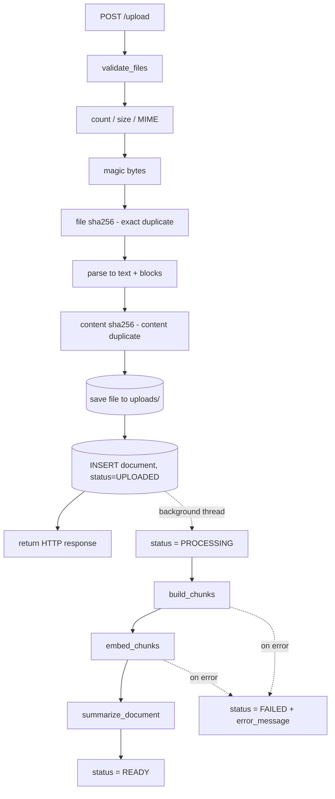
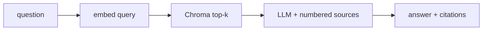
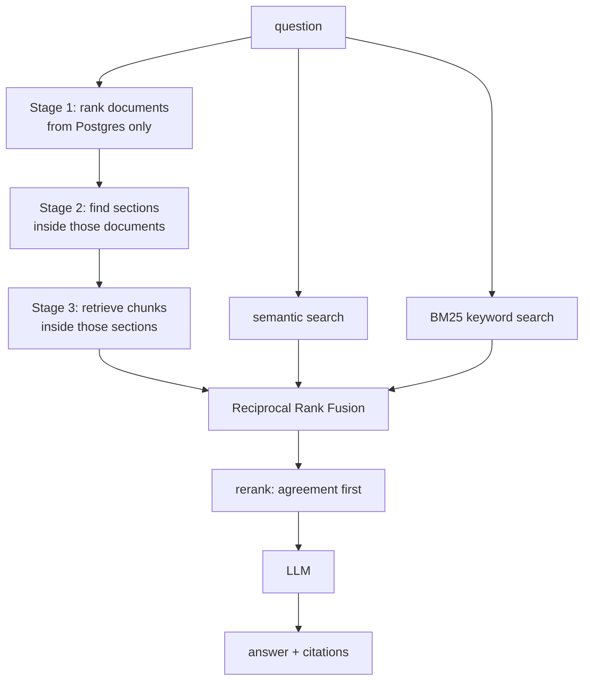
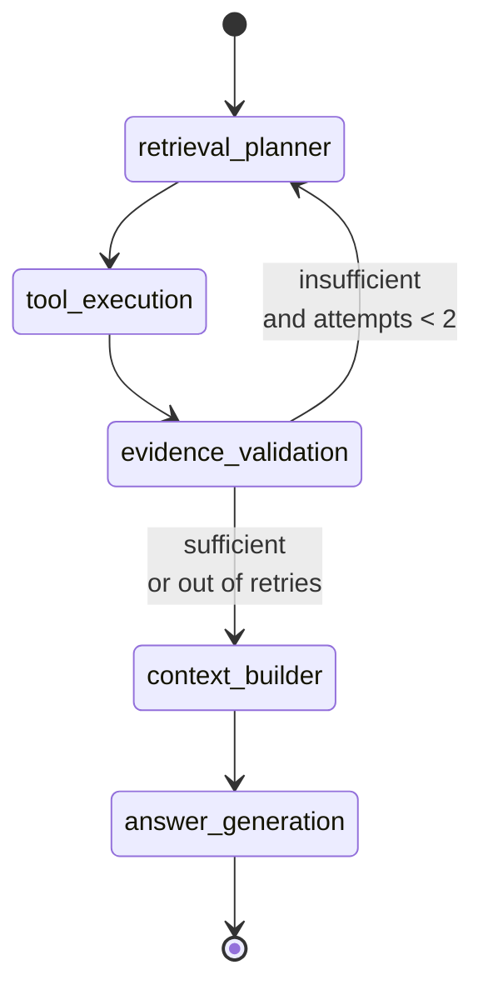

# PORT-6 Workflows

How data moves through the system. Two pipelines: **ingestion** (upload → searchable) and **query** (question → cited answer, in one of three modes).

---

## Processes

| Process | Command | Responsibility |
|---|---|---|
| API | `uv run uvicorn port6.main:app --reload` | HTTP endpoints **and** background ingestion |
| Frontend | `npm --prefix frontend run dev` | React UI, talks to the API over HTTP only |
| Postgres | — | document rows and metadata |
| Chroma | — | chunk vectors, on disk in `chroma_data/` |
| Ollama / OpenAI | — | embeddings and generation |

There is no separate worker. Ingestion runs in a FastAPI `BackgroundTasks` thread inside the API process.

---

## Ingestion

Triggered by `POST /upload`. The response returns as soon as files are validated and stored; everything after that happens in the background.



### Stage by stage

**1. Validation** — `services/files/filevalidator.py`

Five gates, in order: file count, file size, declared MIME type, magic bytes (the declared type is not trusted), then SHA-256 of the bytes for exact duplicates. The file is parsed, and a second SHA-256 over the extracted text catches the same document uploaded in a different format.

**2. Parsing** — `services/parsers/parser.py`

Returns a `ParsedDocument` with `.text` (joined plain text, stored in Postgres) and `.blocks` — an ordered list of `ParsedBlock`, each carrying `text`, `page_number`, and `heading_level`.

Where headings come from:

| Format | Heading source |
|---|---|
| DOCX | paragraph style names (`Heading 1`…), real outline |
| Markdown | rendered `<h1>`…`<h6>` levels |
| PDF | shape heuristic (numbered `4.2`, ALL CAPS, Title Case) |
| TXT | same heuristic |

Page numbers are attached **per page during PDF parsing**, before pages are joined — after joining they are unrecoverable.

> **A file is identified by its filename.** Nothing infers a title, a type
> or an owning department from the content. That used to be a stage here —
> it cost a model call per upload to produce a label nothing could verify,
> and the section path already says where a citation came from. A citation
> now reads *hr_policy.md, Section 1.1 Annual Leave*.

**3. Chunking** — `services/structure/service.py` + `services/chunking/service.py`

Blocks are grouped into a section tree by their heading levels. Each section knows its `section_id`, `level`, `parent_section_id`, and `path` (root-down titles).

Chunks are then cut **inside each section separately**, never across section boundaries, so one chunk cannot contain the tail of the annual leave section and the head of the probation section.

Every chunk is stamped with:

```
document_id  chunk_id  filename  chunk_index  page_number
section_id  section_title  section_path  parent_section_id  section_level
```

`None` values are dropped — Chroma rejects them.

**4. Embedding** — `services/vector/chroma.py`

The store is a single shared client built once under a lock: ingestion runs
in background threads, and several threads constructing a Chroma client
against the same directory at once races inside Chroma's registry.

Existing chunks for the document are deleted first (re-ingestion can produce fewer chunks; deleting avoids orphans at higher indices), then `vector_store.add_documents(chunks, ids=ids)` writes through the **configured** embedding function.

> Writing to `_collection.upsert()` directly would make Chroma silently embed with its own default model and store the wrong vector dimension.

**5. Summary** — one LLM call per document, best-effort. A model failure
logs a warning and leaves `summary` null; the document still reaches `READY`
and stays queryable, though see the note on stage 1 below — the summary is
what makes a document findable *as a document*.

---

## Query

All three modes share the same entry point, prompt, and citation handling. Only retrieval differs.

```python
from port6.services.rag.system import query

result = await query(question, mode="naive" | "hybrid" | "agentic", top_k=5)
```

Every mode returns the same `RagResult`:

```
answer  answered  citations  retrieved_chunks
retrieval_method  latency_ms  metadata  debug
```

### Mode 1 — Naive



No keyword matching and no hierarchy — a chunk is ranked purely on embedding distance to the question. This is the baseline the other modes improve on.

### Mode 2 — Hybrid + Hierarchical



**Hierarchical narrowing is genuinely progressive.** Stage 1 ranks
*documents* using BM25 over their filenames and summaries in Postgres — the
chunk index is never touched. The summary is effectively the whole signal
there: a filename is two or three tokens, so a document that failed to
summarise scores 0 against most queries and can only be reached by stage 3. Stage 2 searches for sections
only within those documents. Stage 3 retrieves chunks only within those
sections.

**Fusion uses RRF, not score averaging.** Chroma returns a distance (lower is
better, unbounded scale), BM25 returns a relevance score (higher is better,
different scale). Those numbers are not comparable; their *ranks* are. Each
list contributes `1/(60 + rank)`, so a chunk both retrievers found
accumulates both contributions and rises to the top.

The hierarchical and flat-hybrid candidates are fused rather than one
replacing the other: hierarchy is precise but can narrow onto the wrong
document, and the flat pass is the safety net.

### Mode 3 — Agentic (LangGraph)



**Graph state** (`AgentState`): `query`, `selected_tools`, `plan_reason`, `tool_runs`, `retrieved_chunks`, `retrieval_metadata`, `validation_result`, `attempts`, `final_context`, `answer`, `citations`, `stages`.

**The five tools:**

| Tool | Use |
|---|---|
| `semantic_search` | general natural-language questions |
| `keyword_search` | exact terms, codes, rare words |
| `hybrid_search` | both fused with RRF |
| `hierarchical_search` | answer sits in a specific part of a known document |
| `document_lookup` | what documents exist (returns filenames and clipped summaries as a chunk, so the model can actually answer from it) |

**Planning** is done by the model on the first attempt (given the tool catalogue, it returns JSON `{"tools": [...], "reason": "..."}`), falling back to rules if the model returns anything unusable. The **retry always uses rules** — it is a deliberate widening to a full hybrid sweep, not a re-plan.

**Evidence validation** runs before the answer. A cheap lexical check first (share of the question's meaningful terms present in the retrieved text); if that passes, the model judges `SUFFICIENT` / `INSUFFICIENT`. If the validator itself errors it falls back to the lexical signal — a validator that cannot run must not block an answer.

Bounded by `MAX_ATTEMPTS = 2`, so an unanswerable question still terminates. If evidence is still thin and nothing was retrieved, the agent **declines** rather than generating.

Only the tools chosen and a one-line plan reason are exposed. Never the model's private reasoning.

---

## Answer generation and citations

`services/rag/generation.py`, shared by all three modes.

Chunks are renumbered `1..n` and rendered with a provenance header:

```
[1] hr_policy.md | section: Acme Corp HR Policy > 1. Leave Entitlements > 1.1 Annual Leave | page 3
Employees accrue 22 days of paid annual leave per calendar year.
```

The filename and section path are in the header so the model can attribute each statement to a specific part of a specific document, which is what the `[n]` marker then resolves back to. The section path comes from the document's *own headings*, so it still reads as prose even though nothing extracts a title.

Three guards on the output:

1. **`NOT_FOUND` sentinel** — if the sources do not contain the answer, the model replies with that exact token, which becomes `answered: false` with no citations rather than a guess.
2. **Hallucinated citations dropped** — a `[7]` when only 4 sources exist is removed and logged, not returned as a dead link.
3. **Degenerate answers retried** — small models sometimes answer a list question with literally `[2]`. If stripping citation markers leaves under 15 letters, it retries once with an explicit nudge, then reports unanswered.

---

## Failure handling

| Situation | Behaviour |
|---|---|
| Empty library | `answered: false`, normal response shape, not an error |
| Nothing relevant retrieved | short-circuits before the LLM |
| Document with no summary | still retrievable by chunk; stage 1 cannot rank it |
| Structure file deleted from `uploads/` | chunks as one unstructured section |
| One agent tool throws | logged, other tools continue |
| A whole mode throws | `system.query` returns a `RagResult` carrying the error, so a comparison still renders the other modes |
| Summariser fails | document still reaches `READY`, `summary` stays null |
