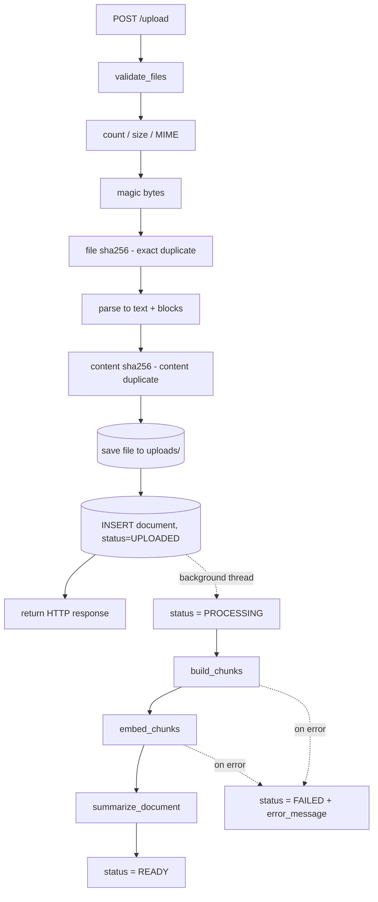
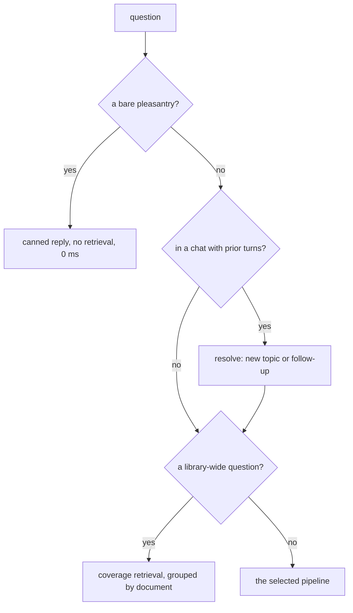
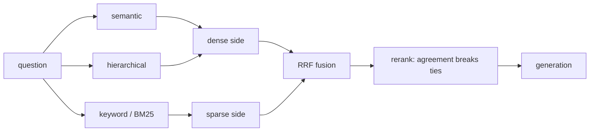
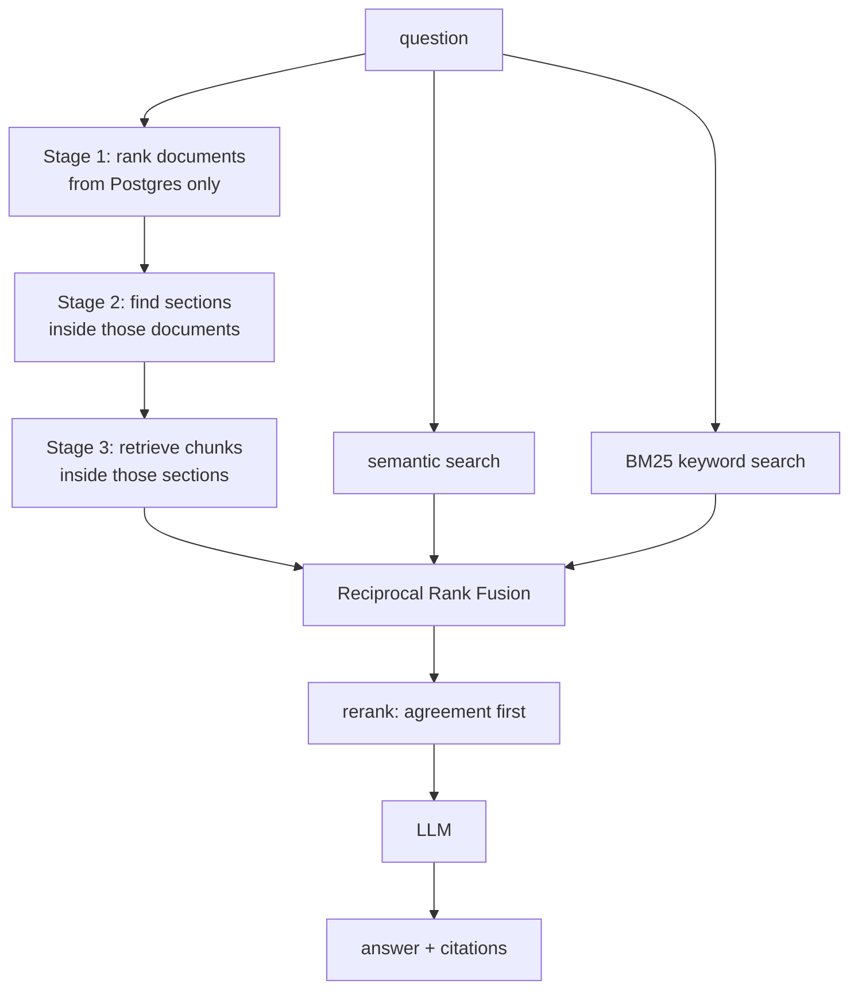
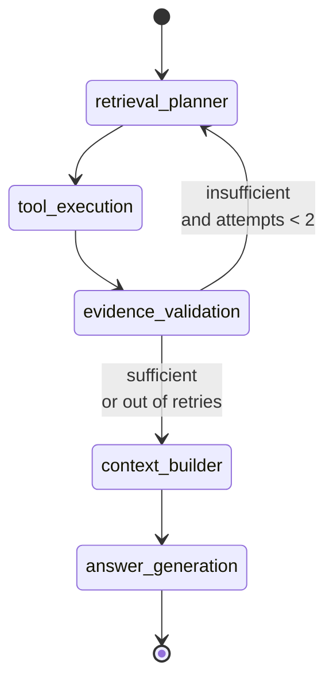

# PORT-6 Workflows

How data moves through the system. Two paths: **ingestion** (upload → searchable) and **query** (question → cited answer, through one of several retrieval pipelines).

The UI has its own counterpart in [frontend/WORKFLOW.md](frontend/WORKFLOW.md).

---

## Processes

| Process | Command | Responsibility |
|---|---|---|
| API | `uv run uvicorn port6.main:app --reload` | HTTP endpoints **and** background ingestion |
| Frontend | `npm --prefix frontend run dev` | React UI, talks to the API over HTTP only |
| Postgres | — | document rows and metadata |
| Chroma | — | chunk vectors, on disk in `chroma_data/` |
| Ollama / OpenAI | — | embeddings and generation |
| Phoenix *(optional)* | `uvx --python 3.12 --from arize-phoenix phoenix serve` | trace viewer. The API emits spans; it does not host the UI |

There is no separate worker. Ingestion runs in a FastAPI `BackgroundTasks` thread inside the API process.

---

## Ingestion

Triggered by `POST /upload`. The response returns as soon as files are validated and stored; everything after that happens in the background.



### Stage by stage

**1. Validation** — `services/files/filevalidator.py`

Five gates, in order: file count, file size, declared MIME type, magic bytes (the declared type is not trusted), then SHA-256 of the bytes for exact duplicates. The file is parsed, and a second SHA-256 over the extracted text catches the same document uploaded in a different format.

**2. Parsing** — `services/parsers/parser.py`

Returns a `ParsedDocument` with `.text` (joined plain text, stored in Postgres) and `.blocks` — an ordered list of `ParsedBlock`, each carrying `text`, `page_number`, and `heading_level`.

Where headings come from:

| Format | Heading source |
|---|---|
| DOCX | paragraph style names (`Heading 1`…), real outline |
| Markdown | rendered `<h1>`…`<h6>` levels |
| PDF | shape heuristic (numbered `4.2`, ALL CAPS, Title Case) |
| TXT | same heuristic |

Page numbers are attached **per page during PDF parsing**, before pages are joined — after joining they are unrecoverable.

> **A file is identified by its filename.** Nothing infers a title, a type
> or an owning department from the content. That used to be a stage here —
> it cost a model call per upload to produce a label nothing could verify,
> and the section path already says where a citation came from. A citation
> now reads *hr_policy.md, Section 1.1 Annual Leave*.

**3. Chunking** — `services/structure/service.py` + `services/chunking/service.py`

Blocks are grouped into a section tree by their heading levels. Each section knows its `section_id`, `level`, `parent_section_id`, and `path` (root-down titles).

Chunks are then cut **inside each section separately**, never across section boundaries, so one chunk cannot contain the tail of the annual leave section and the head of the probation section.

Each chunk carries the page of the block it actually starts in, recovered
from the splitter's start offset. Stamping every chunk with the section's
*first* page meant a section spanning pages 4–7 cited all of its content as
page 4.

Every chunk is stamped with:

```
document_id  chunk_id  filename  chunk_index  page_number
section_id  section_title  section_path  parent_section_id  section_level
```

`None` values are dropped — Chroma rejects them.

**4. Embedding** — `services/vector/chroma.py`

The store is a single shared client built once under a lock: ingestion runs
in background threads, and several threads constructing a Chroma client
against the same directory at once races inside Chroma's registry.

Existing chunks for the document are deleted first (re-ingestion can produce fewer chunks; deleting avoids orphans at higher indices), then `vector_store.add_documents(chunks, ids=ids)` writes through the **configured** embedding function.

> Writing to `_collection.upsert()` directly would make Chroma silently embed with its own default model and store the wrong vector dimension.

**5. Summary** — one LLM call for a short document; a longer one is
summarised in windows that span its whole length and the parts combined,
because summarising only the opening made the largest documents the hardest
to find at stage 1.

Best-effort: a model failure logs a warning, leaves `summary` null, and the
document still reaches `READY` — but it is flagged on `/documents/attention`
and can be reprocessed, because a document with no summary is much weaker at
stage 1.

**Failure is recoverable.** The uploaded file is never deleted, so a
document that failed on a stopped Ollama or an expired key keeps its bytes.
`documents.attempts`, `last_attempt_at` and `failure_kind` record what
happened, and `POST /documents/{id}/reprocess` runs it again.

---

## Conversations

Every question belongs to a chat. One is created if none is given, and its
id comes back in `metadata.chat_id`, so a caller never has to decide up
front that it wanted a conversation.

A question that arrives in a chat is first *resolved* against the turns
before it, because some questions are not searchable as written:

```
Q1  "What is the maternity leave policy?"
Q2  "What about sick leave?"      -> retrieves almost nothing on its own
Q3  "Who is eligible?"            -> matches eligibility in every policy
```

**The expensive failure is the false positive.** Carrying maternity-leave
context into a question about expenses produces a confident wrong answer,
so the default is "new topic" and a follow-up has to be argued for.

Resolution runs in two halves:

1. **Rules, free.** A question carrying no dependent signal — no pronoun,
   no ellipsis, not a bare interrogative — is searchable as written and is
   treated as a new topic without a model call. Most questions stop here.
   This can only fail *safe*: the fallback is to ignore prior context, not
   to apply it.
2. **One small model call**, only for the rest. It returns the relation,
   the question rewritten to stand alone, and what to do with prior chunks.

Three outcomes:

| Strategy | When | What happens |
|---|---|---|
| `fresh` | new topic | Prior context is discarded entirely |
| `combine` | most follow-ups | Retrieve on the rewritten question, then merge a few chunks from the previous turn |
| `reuse` | "explain that more simply" | Answer from the previous turn's chunks; no retrieval runs |

A follow-up's rewritten question is what retrieval and generation actually
see; the user's original wording is what gets displayed and stored. Both
are recorded on the run, so an answer can be traced back to what was
really searched.

If the classifier fails, the question is searched as written and prior
context is ignored — a thinner answer, never one built on the wrong
document.

---

## Query

Every pipeline shares the same entry point, the same prompt and the same citation handling. Only retrieval differs — which is the point: a difference in the answer is a difference in what was retrieved, not in how it was written up.

```python
from port6.services.rag.system import query

result = await query(
    question,
    composition=Composition(retrievers=("semantic", "keyword")),
    top_k=5,
)
```

All of them return the same `RagResult`:

```
answer  answered  citations  retrieved_chunks
retrieval_method  latency_ms  metadata  debug
```

### Choosing a pipeline

Three things can decide it, in order:

1. an explicit `pipeline` on the request
2. a bare `mode`, which maps to the pipeline reproducing what that mode used to do
3. neither — the configured `defaults.mode`, mapped through the families below

That last one is why the header settings reach a new chat *and* an API call that names nothing. The setting is a default, not a lock.

The chat composer offers the three modes. The full list is reachable from the **Pipelines** page, which exists to compare them.

There is one pipeline. What varies is what you put in it:

| Retriever | Good at | Blind to |
|---|---|---|
| `semantic` | a paraphrase sharing no words with the document | an exact code with no useful neighbourhood |
| `keyword` | codes, names, rare words | a question phrased in different vocabulary |
| `hierarchical` | a long structured document | anything whose document does not rank first |

Any combination is valid. The composition's identity is derived, not chosen from a list — `semantic+keyword`, `agent[calculate]:keyword` — and that slug is what gets recorded on the query run, so a stored answer says exactly what produced it.

This used to be a registry of seven named pipelines, which was the wrong shape. Three retrievers combine seven ways and the agent multiplies that again; naming a handful makes the rest unreachable and implies the named ones are special.

**The agent is a layer, not an alternative.** With it on, the chosen retrievers become the tools it may plan over, plus any extras selected (`document_lookup`, `calculate`, `web_search`). It adds tool selection, evidence validation and a retry, and nothing else changes — so a with-agent against without-agent comparison varies one thing.

| Family | What counts as it |
|---|---|
| naive | one retriever, no agent |
| hybrid | two or more retrievers, no agent |
| agentic | any composition with the agent on |

### Before retrieval

Three checks run first, in every pipeline.



`hello` is answered directly because otherwise it embeds, returns the five least-unrelated chunks and is refused — which reads as a broken system rather than an honest one. Matching is exact after normalisation, so `hi, how much annual leave?` is treated as the question it is.

### Composing the retrievers



Hierarchical results join the dense side because both rank by embedding distance, which makes them comparable to each other and not to BM25. A pipeline naming one retriever skips fusion entirely — its own ordering *is* the ranking.

RRF rather than score averaging, because a Chroma distance is better when lower and a BM25 score is better when higher. Ranks are comparable; raw scores are not.

### Where each retriever earns its place

| Question | Keyword | Semantic |
|---|---|---|
| *"What does SEC-1177 cover?"* | finds it | no useful neighbourhood — **declines** |
| *"Can I work from another country for a while?"* | shares almost no vocabulary — **declines** | finds it |

That is the whole argument for hybrid, and it is reproducible on the demo corpus from the `/pipelines` page.

### Hierarchical narrowing, stage by stage



**Hierarchical narrowing is genuinely progressive.** Stage 1 ranks
*documents* using BM25 over their filenames and summaries in Postgres — the
chunk index is never touched. The summary is effectively the whole signal
there: a filename is two or three tokens. A document with no summary falls
back to the opening of its content, so it stays rankable rather than
dropping out of document-level retrieval entirely. Stage 2 searches for sections
only within those documents. Stage 3 retrieves chunks only within those
sections.

**Fusion uses RRF, not score averaging.** Chroma returns a distance (lower is
better, unbounded scale), BM25 returns a relevance score (higher is better,
different scale). Those numbers are not comparable; their *ranks* are. Each
list contributes `1/(60 + rank)`, so a chunk both retrievers found
accumulates both contributions and rises to the top.

The hierarchical and flat-hybrid candidates are fused rather than one
replacing the other: hierarchy is precise but can narrow onto the wrong
document, and the flat pass is the safety net.

### Cross-document aggregation

Some questions are answered by breadth, not depth:

```
"Which documents mention probation?"
"What does each policy say about notice periods?"
"Compare the leave policies across all documents."
```

Plain top-k fails these *structurally*. With `top_k=5` every chunk can come
from one document, so the model is never shown the others and cannot
enumerate them however it is prompted.

Hybrid detects these with a conservative set of patterns — they all name
documents explicitly or ask for an exhaustive list, so *"how many days of
annual leave"* does not match — and switches to coverage retrieval:

1. **Topic terms** are separated from the asking-about-the-library
   scaffolding. *"What does each policy say about probation?"* has one real
   term, `probation`; matching on `policy` or `say` would qualify every
   document.
2. **One wide query**, then group by document keeping the best few from
   each, so a verbose document cannot take every slot.
3. **Documents with no keyword hit on the topic are dropped.** Semantic
   search returns the nearest chunk from every document whether or not it
   mentions the subject, and in an enumeration answer those near-misses are
   actively harmful.
4. **The context is grouped by document**, with `=== DOCUMENT: name ===`
   headings, so the boundaries the answer must enumerate are visible.

Agentic reaches the same thing through the `aggregate_search` tool, which
the planner selects for library-wide questions.

**Top K is a chunk budget, here as everywhere else.** Coverage decides how those chunks are *spread* — every matching document gets its first before any gets a second — not how many there are. Asking for 5 returns 5, spread across up to 5 documents.

When more documents match than the budget can cover, the weakest are dropped and the count is reported (`3 of 10`), because a coverage answer that quietly dropped seven documents reads as though it had covered everything.

### The agentic family (LangGraph)



**Graph state** (`AgentState`): `query`, `selected_tools`, `plan_reason`, `tool_runs`, `retrieved_chunks`, `retrieval_metadata`, `validation_result`, `attempts`, `aggregated`, `web_attempted`, `final_context`, `conflicts`, `answer`, `citations`, `stages`, plus `use_planner` and `max_attempts` from the pipeline.

**The planner is optional.** A composition with `planner: false` chooses tools by rule, runs once and never retries. Running it beside the planned version is how you find out what the planning call is buying: on the demo corpus it is roughly 2.9 s against 1.3 s for the same answer.

**The allow-list is the important part.** `allowed_tools` comes from the composition's retrievers, so a keyword-only composition cannot be handed `semantic_search` — not by the planner, and not by the rule-based fallback either, which filters its preferences through the same list. `hybrid_search` appears only when both halves are present. `aggregate_search` is always available, because any composition has to be able to answer a library-wide question. Selecting `web_search` still cannot switch the web on: the composition asks, `web.enabled` decides.

**The eight tools:**

| Tool | Use |
|---|---|
| `semantic_search` | general natural-language questions |
| `keyword_search` | exact terms, codes, rare words |
| `hybrid_search` | both fused with RRF |
| `hierarchical_search` | answer sits in a specific part of a known document |
| `aggregate_search` | questions about the library as a whole: which documents mention X, comparing across documents |
| `calculate` | arithmetic the answer depends on — remaining leave, a percentage of a cap |
| `web_search` | the public web, when the library cannot answer. **Off by default** |
| `document_lookup` | what documents exist (returns filenames and clipped summaries as a chunk, so the model can actually answer from it) |

Tools are LangChain `@tool` objects, so each one's name, description and
arguments are defined once, beside the code. They are still selected by
*prompt* rather than by function calling: the local model picks the right
tool reliably but emits the choice as JSON in its content and leaves
`tool_calls` empty, so `bind_tools` and `ToolNode` would see nothing. On a
provider with working function calling the same definitions work unchanged.

Two of them are not retrieval:

- **`calculate`** evaluates arithmetic through an AST walker, never `eval`
  — the expression comes from a model, and `eval` on model output is
  arbitrary code execution. The agent hands every tool the raw question,
  so when it receives a sentence it recovers the expression first
  (*"Annual leave is 22 days. If I have taken 8…"* → `22 - 8` → `14`).
- **`web_search`** reaches the public internet, which changes what an
  answer means. It is off by default, withheld from the planner entirely
  when unavailable, refused outright for a question scoped to specific
  documents, and its results are labelled `WEB` in the context, badged in
  the UI and linked to their source rather than to a document.

**Planning** is done by the model on the first attempt (given the tool catalogue, it returns JSON `{"tools": [...], "reason": "..."}`), falling back to rules if the model returns anything unusable. The **retry always uses rules** — it is a deliberate widening to a full hybrid sweep, not a re-plan.

**Evidence validation** runs before the answer, in three bands. Below
`validation.min_overlap` the evidence is rejected outright; above
`validation.skip_model_above` it is accepted without asking the model, because
a small model reliably calls plainly good sources insufficient and each false
negative costs a full retry that changes nothing. Only in between does the
model judge `SUFFICIENT` / `INSUFFICIENT`. If the validator errors it falls
back to the lexical signal — a validator that cannot run must not block an
answer.

**Tool results are fused by rank, not by score.** A Chroma distance is better
when lower and a BM25 score when higher, so sorting the two together ranked a
keyword-only plan backwards and answered from the *worst* matches it found.
Each tool returns its own best-first ordering, and RRF over those positions is
what the context builder sorts on.

Bounded by the `agent.max_attempts` setting, so an unanswerable question still terminates. If evidence is still thin and nothing was retrieved, the agent **declines** rather than generating.

Only the tools chosen and a one-line plan reason are exposed. Never the model's private reasoning.

---

## Answer generation and citations

`services/rag/generation.py`, shared by every pipeline.

Chunks are renumbered `1..n` and rendered with a provenance header:

```
[1] hr_policy.md | section: Acme Corp HR Policy > 1. Leave Entitlements > 1.1 Annual Leave | page 3
Employees accrue 22 days of paid annual leave per calendar year.
```

The filename and section path are in the header so the model can attribute each statement to a specific part of a specific document, which is what the `[n]` marker then resolves back to. The section path comes from the document's *own headings*, so it still reads as prose even though nothing extracts a title.

Two source types are labelled rather than blended in. A `WEB` header marks a result from the public internet; a `CALCULATION` header marks arithmetic this system worked out. Both are evidence, and neither came from a document someone uploaded.

### On the way in

**A bare topic becomes a question.** `leave policy` names no answer to look for, so the prompt — told to reply `NOT_FOUND` when the sources lack *the answer* — would read five perfectly good chunks and decline. A short phrase with no question mark and no leading question word is rewritten to *"What do the documents say about X?"* before generating. Retrieval still uses the words as typed.

**Arithmetic is worked out, not predicted.** If the question looks numeric, an expression is written from the question *and the retrieved sources*, evaluated by walking an AST against an allow-list, and offered as one more numbered source. Running after retrieval is what lets a formula living in a document be applied rather than guessed — `overtime pay = rate × 1.5 × hours` gives `20 * 1.5 * 6`, where the same step run before retrieval produced `20 * 6`.

**Disagreements are surfaced.** Where two documents state different figures for the same thing, the most recently uploaded wins and the answer says what the older one said. Recency is a heuristic — nothing in a file states that it supersedes another — which is exactly why the older figure is reported rather than dropped.

### On the way out

1. **`NOT_FOUND` sentinel** — if the sources do not contain the answer, the model replies with that exact token, which becomes `answered: false` with no citations rather than a guess.
2. **Hallucinated citations dropped** — a `[7]` when only 4 sources exist is removed and logged, not returned as a dead link.
3. **Degenerate answers retried** — small models sometimes answer a list question with literally `[2]`. If stripping citation markers leaves under 15 letters, it retries once with an explicit nudge, then reports unanswered.
4. **A cited calculation credits its sources** — the chunk that supplied the 22 is added to the citations, so the document doing the work is not reported as retrieved-but-unused.

---

## Defaults

Two settings decide what a request that names nothing gets:

| Setting | Default | Applies to |
|---|---|---|
| `defaults.mode` | `hybrid` | a new chat, and any `/ask` naming neither a mode nor a pipeline |
| `defaults.top_k` | `5` | the same |

A **mode**, not a pipeline. A chat picks between the three families; picking between the strategies inside one is a retrieval question, and the Pipelines page is where you can answer it by running both on the same question. Storing a pipeline id here would allow a default the chat UI could not display.

They live in Postgres, not in the browser. A default held in `localStorage` would be a different default on a colleague's machine, would vanish on a cache clear, and would not apply to a question asked over the API. Editable from the header dialog or `PUT /settings/{key}`, and live on the next request — the settings cache is invalidated on write, so no restart.

All 25 settings and 8 prompts work the same way. Seeding advances a row that still matches its shipped default and never touches one that has been edited, so a release can improve a prompt without overwriting your changes.

---

## Failure handling

| Situation | Behaviour |
|---|---|
| Empty library | `answered: false`, normal response shape, not an error |
| Nothing relevant retrieved | short-circuits before the LLM |
| Document with no summary | still retrievable by chunk; stage 1 cannot rank it |
| Structure file deleted from `uploads/` | chunks as one unstructured section |
| One agent tool throws | logged, other tools continue |
| A whole pipeline throws | `system.query` returns a `RagResult` carrying the error, so a comparison still renders the others |
| Summariser fails | document still reaches `READY`, `summary` stays null |
| Provider unreachable or key expired | classified and reported as a sentence with the fix, not a traceback |
| `defaults.mode` holds something that is not a mode | logged, falls back to `hybrid` |
| Web search unavailable or failing | returns nothing; the tool is withheld from the planner rather than offered and left to fail |
| Phoenix collector down | swallowed. Observability that can take the service down is worse than none |
| Chunk-count tally fails | the document list still renders, with counts at zero |
