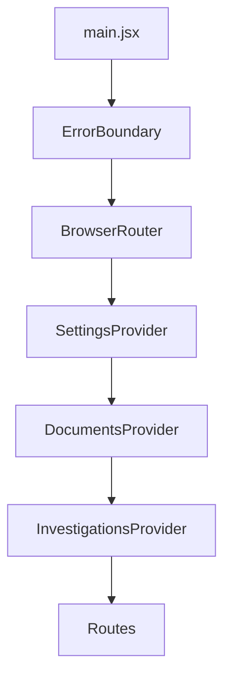
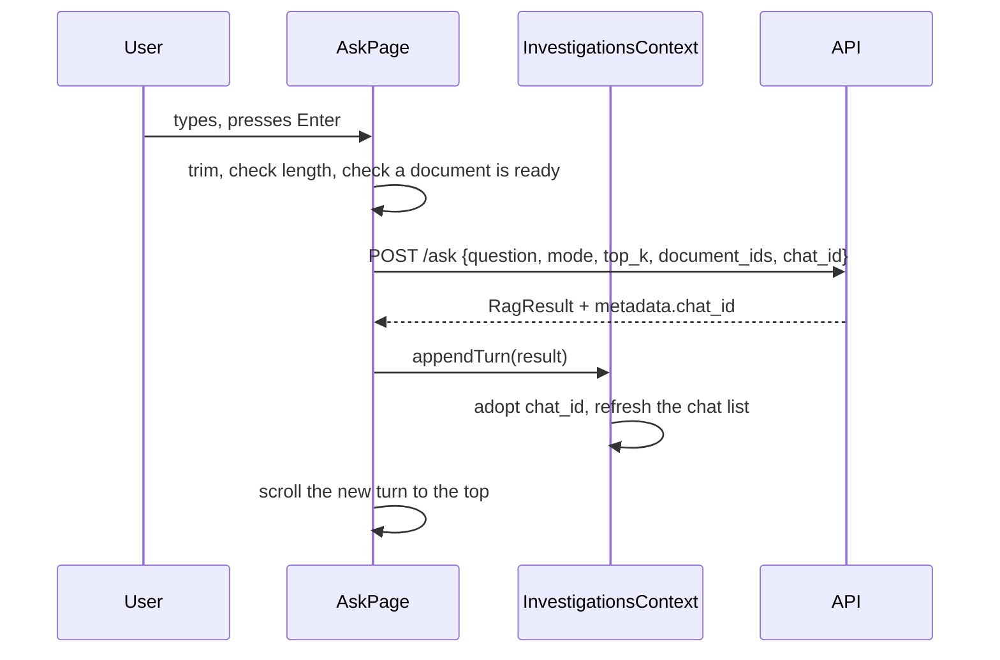
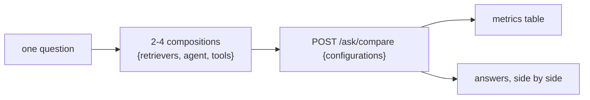
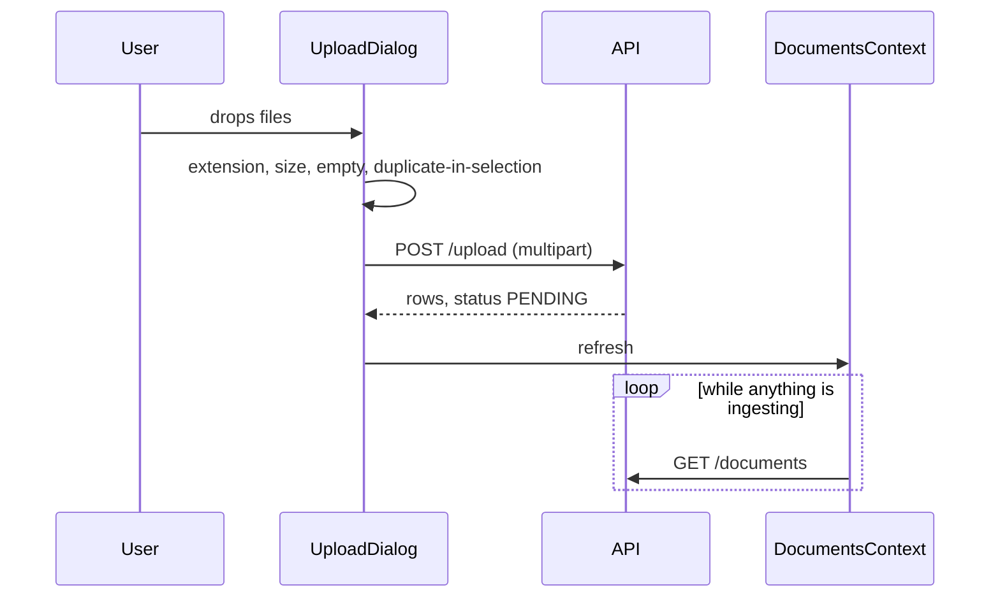
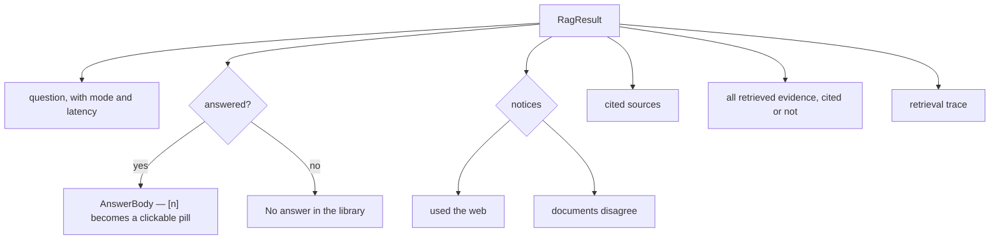

# Frontend Workflows

How data moves through the UI. The backend counterpart is
[../WORKFLOW.md](../WORKFLOW.md).

The browser never talks to Postgres, Chroma or a model. Everything goes
through the API over HTTP, which is what lets the UI be pointed at a
remote backend without changing a line.

---

## Startup

The boundary sits **outside** the router, so a crash in the shell itself
is caught, not only one inside a route.

Each provider fetches once on mount:

| Provider | Fetches | Then |
|---|---|---|
| Settings | `GET /pipelines`, `GET /settings` | holds what a pipeline can be built from, and the chat defaults |
| Documents | `GET /documents` | polls while anything is ingesting, stops when nothing is |
| Investigations | `GET /chats` | holds the conversation list and the open one |

A provider that fails sets an error and carries on. The app still works
without the catalogue — the server applies its own defaults to a request
that names nothing.

---

## Asking a question

### What the composer sends

| Field | From |
|---|---|
| `mode` | the segmented control, or `defaults.mode` if untouched |
| `top_k` | the select, or `defaults.top_k` |
| `document_ids` | the `?docs=` query parameter, set by "Ask about this" in Files |
| `chat_id` | the open conversation, or null to start one |

Mode and Top-K are held as `null` meaning *follow the default*, rather
than seeded from it. Seeding would capture whatever the default was on
first render — and settings load asynchronously, so on a cold start that
is nothing.

### Checks before the request

- **Empty** — the button is disabled.
- **Over 1000 characters** — a counter appears from 800 and turns red past
  the limit; submit is blocked on the button, on Enter, and inside `run()`,
  because Enter bypasses the button. The server constraint still exists;
  this is so the way you find out is not a 422 reading *"String should
  have at most 1000 characters"*.
- **Nothing ready to search** — the empty state offers Upload instead.

### Scrolling

The new turn is scrolled to the top of the reading area, keyed on the
turn count so it runs after React has laid it out. It used to scroll a
sentinel at the *end* of the thread, which pins the page bottom to the
top of the viewport and pushes the answer off-screen above it.

---

## Building and testing pipelines

`/pipelines` composes rather than selects. Each builder is a set of
retriever chips, an agent switch, and the tools that agent may use.

The tool picker appears only once the agent is on — tools are meaningless
without one to use them, so they show up when they start mattering rather
than sitting greyed out.

**Retrieval tools are not in the picker.** They come from the retriever
chips above, which is what makes an agent-on against agent-off comparison
vary one thing. A tool the server has switched off is shown greyed and
labelled, rather than offering a control that silently does nothing.

The server runs them **sequentially** — one local model, one generation
at a time — so the client timeout scales with how many were asked for
rather than assuming three.

It starts with semantic against keyword: the pair that differ most, so
the first run teaches something. Two identical hybrids would not.

The table reports answered, citations, chunks, documents and latency,
plus tools used when an agent ran and coverage when the question went
library-wide. Nothing scores answer *quality* — that would need a judge
model and would be the least trustworthy number on the page.

---

## Uploading

The dialog checks what it can before the request so an obvious problem
is immediate, but the API is still the authority — it also checks magic
bytes and content hashes, which a browser cannot.

Ingestion is a background task server-side, so the response returns
straight away and progress comes from polling.

---

## Reading an answer

Clicking `[n]` scrolls to that source and highlights it. Evidence is
shown whether or not it was cited — *retrieved and unused* is
information, and hiding it would make retrieval look better than it was.

Three things are called out rather than left to be inferred: an answer
that used the **web**, documents that **disagree** on a figure, and a
**calculation** among the sources.

---

## Errors

| Situation | What the UI does |
|---|---|
| API unreachable | the sidebar shows it; pages render their error state |
| A request fails | the message from the API body, not a status code |
| Provider down | the API classifies it; the answer panel explains it and says whether retrying helps |
| A render throws | the error boundary catches it, with a route back |
| Unknown route | a real 404 outside the shell |
| Settings fail to load | the app runs on the server's defaults |

---

## Conventions

**Plain JavaScript.** No TypeScript. The API contract is the source of
truth, and it is enforced server-side by Pydantic.

**No component library.** `components/ui/` is the design system. A
primitive that only one page uses lives with that page instead.

**Colours are tokens.** `index.css` defines them for light and dark;
`tailwind.config.js` maps them to class names. Adding a *key* needs a
dev-server restart — the config is read once at startup, so the edit
appears to do nothing.

**Rendering is tested, not assumed.** `npm test` renders each page inside
the real provider stack with the API mocked. The build compiles JSX
without executing it, so it cannot catch a component handed the wrong
prop shape.
